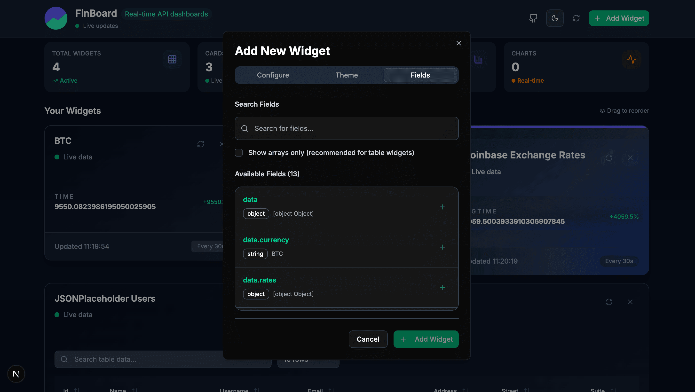
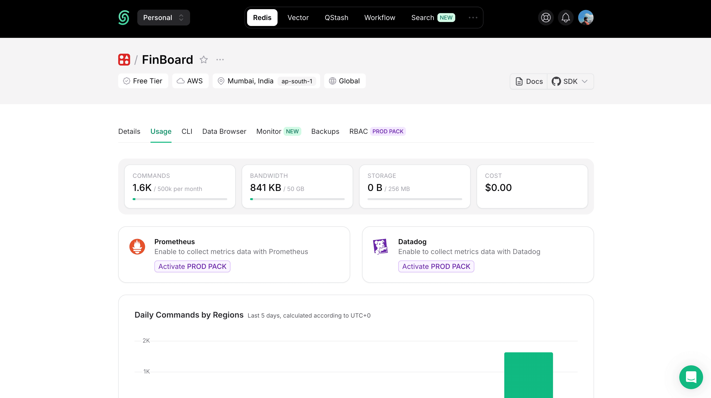

# FinBoard

**FinBoard** is a customizable, real-time finance dashboard builder that lets you create beautiful data visualizations by connecting to any JSON API. Build your own financial monitoring dashboard with drag-and-drop widgets, real-time data updates, and seamless API integration.


## ✨ Features

### Core Functionality
- **Dashboard Builder**: Create, customize, and manage multiple widgets with an intuitive drag-and-drop interface.
- **Real-time Data**: Automatic data refresh with configurable intervals (10s to 1 hour).
- **API Integration**: Connect to any JSON API endpoint using a secure server-side proxy.
- **Field Selection**: Smart field detection and selection for optimal data visualization.

### 📊 Widget Types
- **📈 Cards**: Display key metrics, prices, and KPIs in beautiful card layouts.
- **📋 Tables**: Sortable, searchable data tables with pagination and filtering.
- **📊 Charts**: Interactive line, bar, and area charts with real-time updates.

### 🛡️ Security, Performance & Data Handling

**Key Highlights:**

- **🔒 Secure Proxy Server**
  - All API requests go through a server-side proxy.
  - Protects your API keys and sensitive credentials.
  - Solves CORS issues and enables secure frontend-to-API communication.

- **⚡ In-Memory Caching**
  - Proxy server caches API responses for ~30 seconds.
  - Reduces redundant requests and boosts dashboard speed.
  - Ensures data is both fresh and fast.

- **🚦 Rate Limiting**
  - Proxy server enforces per-IP rate limits.
  - Prevents API abuse and keeps usage within safe limits.

- **💾 Data Persistence**
  - Widget setups and dashboard layouts are saved locally (localStorage/IndexedDB).
  - Your customizations stay even after refresh or browser restart.

- **🗂️ State Management (Zustand)**
  - Uses [Zustand](https://github.com/pmndrs/zustand) for fast, scalable state management.
  - Efficiently manages widget states, layouts, and user preferences.

- **🛑 Robust Error Handling**
  - Clear error states and loading indicators for a smooth user experience.

- **🧠 Smart Data Validation**
  - Automatic data parsing and field type detection for reliable, accurate visualizations.

### 🎨 User Experience
- **Dark/Light Theme**: Seamless theme switching with system preference detection.
- **Responsive Design**: Optimized for desktop, tablet, and mobile devices.
- **Drag & Drop**: Intuitive widget reordering and layout management.
- **Search & Filter**: Advanced filtering and search capabilities for tables.

### 🛡️ Security, Performance & Data Handling

**Key Highlights:**

- **🔒 Secure Proxy Server**
  - All API requests go through a server-side proxy.
  - Protects your API keys and sensitive credentials.
  - Solves CORS issues and enables secure frontend-to-API communication.

- **⚡ In-Memory Caching**
  - Proxy server caches API responses for ~30 seconds.
  - Reduces redundant requests and boosts dashboard speed.
  - Ensures data is both fresh and fast.

- **🚦 Rate Limiting**
  - Proxy server enforces per-IP rate limits.
  - Prevents API abuse and keeps usage within safe limits.

- **💾 Data Persistence**
  - Widget setups and dashboard layouts are saved locally (localStorage/IndexedDB).
  - Your customizations stay even after refresh or browser restart.

- **🗂️ State Management (Zustand)**
  - Uses [Zustand](https://github.com/pmndrs/zustand) for fast, scalable state management.
  - Efficiently manages widget states, layouts, and user preferences.

- **🛑 Robust Error Handling**
  - Clear error states and loading indicators for a smooth user experience.

- **🧠 Smart Data Validation**
  - Automatic data parsing and field type detection for reliable, accurate visualizations.

### 🎨 User Experience
- **Dark/Light Theme**: Seamless theme switching with system preference detection.
- **Responsive Design**: Optimized for desktop, tablet, and mobile devices.
- **Drag & Drop**: Intuitive widget reordering and layout management.
- **Search & Filter**: Advanced filtering and search capabilities for tables.

## 🚀 Quick Start

### Prerequisites
- Node.js 18+ 
- npm or yarn

### Installation

1. **Clone the repository**
   ```bash
   git clone https://github.com/priyanshu082/finboard_groww.git
   cd finboard_groww
   ```

2. **Install dependencies**
   ```bash
   npm install
   # or
   yarn install
   ```

3. **Run the development server**
   ```bash
   npm run dev
   # or
   yarn dev
   ```

4. **Open your browser**
   Visit [http://localhost:3000](http://localhost:3000) to view the dashboard.

---

## 🛠️ Usage

1. **Add a Widget**: Click the "Add Widget" button to create a new card, table, or chart. Enter your API endpoint and select the fields you want to visualize.


2. **Select Fields**: Choose which data fields to display in your widget with smart field detection.



3. **Choose Theme**: Select from 3 professional themes for your widget - Classic, Minimal, or Glass.

4. **Drag & Drop**: Reorder widgets by dragging them around the dashboard.

5. **Theme Toggle**: Switch between light and dark mode using the theme toggle in the header.

6. **Live Updates**: Data refreshes automatically every 30 seconds (configurable per widget).

---

## 🏗️ Production Deployment

### Redis Implementation for Production

For production environments, the proxy server supports Redis caching for enhanced performance and scalability:

```typescript
// Production Redis Configuration
const redis = new Redis({
  host: process.env.REDIS_HOST || 'localhost',
  port: parseInt(process.env.REDIS_PORT || '6379'),
  password: process.env.REDIS_PASSWORD,
  db: parseInt(process.env.REDIS_DB || '0'),
});

// Caching with Redis
async function getCachedResponse(cacheKey: string): Promise<unknown | null> {
  try {
    const cached = await redis.get(cacheKey);
    if (cached) {
      const parsed = JSON.parse(cached);
      if (parsed.expires > Date.now()) {
        return parsed.data;
      }
      await redis.del(cacheKey);
    }
  } catch (error) {
    console.error('Redis cache read error:', error);
  }
  return null;
}
```

**Benefits of Redis in Production:**
- **Distributed Caching**: Share cache across multiple server instances
- **Persistence**: Cache survives server restarts
- **Memory Efficiency**: Better memory management than in-memory caching
- **Scalability**: Handle high traffic with distributed cache
- **Advanced Features**: TTL, pub/sub, and clustering support



### Environment Variables for Production

```bash
# Redis Configuration
REDIS_HOST=your-redis-host
REDIS_PORT=6379
REDIS_PASSWORD=your-redis-password
REDIS_DB=0

# API Configuration
API_RATE_LIMIT=100
API_CACHE_TTL=30000
```

---

## 📦 Project Structure

- `src/components/` - UI components and widgets
- `src/components/Theme/` - Widget theme system and wrappers
- `src/lib/` - Utility functions (data formatting, etc.)
- `src/app/api/proxy/` - Secure API proxy route (handles CORS, caching, rate limiting)
- `src/store/` - Zustand state management
- `public/` - Static assets and screenshots

---

## 🎨 Theme System Architecture

The theme system is built with modularity and consistency in mind:

```
src/components/Theme/
├── WidgetWrapper.tsx          # Classic theme wrapper
├── WidgetWrapperMinimal.tsx   # Minimal theme wrapper  
├── WidgetWrapperGlass.tsx     # Glass theme wrapper
├── ThemeSelector.tsx          # Theme selection component
└── WidgetThemeEditor.tsx      # Theme editing interface
```

Each theme wrapper provides:
- Consistent spacing and typography
- Theme-specific color schemes
- Responsive design patterns
- Dark/light mode support
- Uniform interaction states

---

## 🤝 Contributing

Contributions, issues, and feature requests are welcome!  
Feel free to open an issue or submit a pull request.

---

## 📄 License

This project is licensed under the MIT License.

---

## 🙏 Acknowledgements

- [Zustand](https://github.com/pmndrs/zustand)
- [Next.js](https://nextjs.org/)
- [Tailwind CSS](https://tailwindcss.com/)
- [React Beautiful DnD](https://github.com/atlassian/react-beautiful-dnd)
- [Recharts](https://recharts.org/) for chart components

---

**Made with ❤️ for finance and data enthusiasts.**
